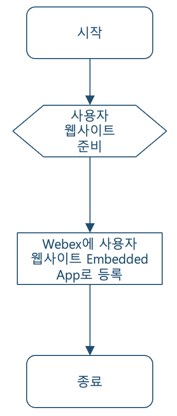
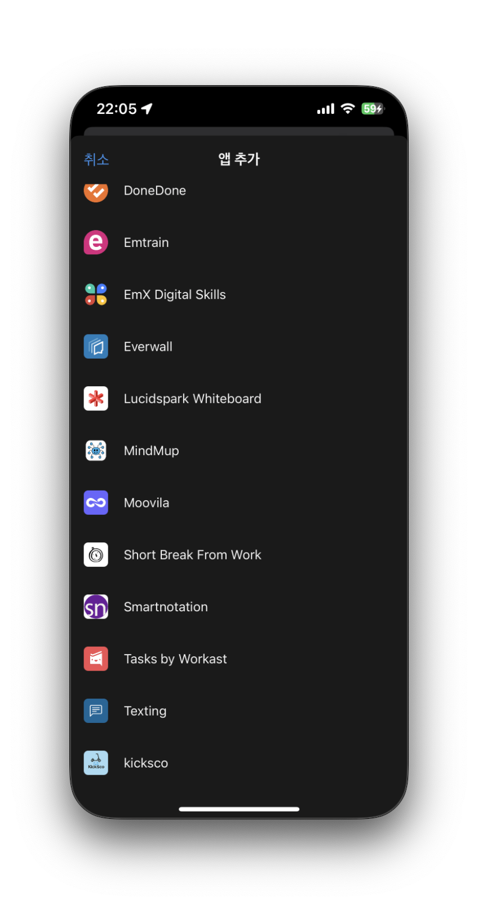
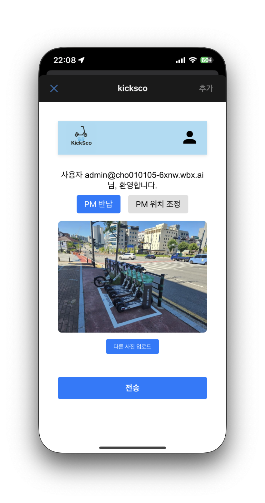
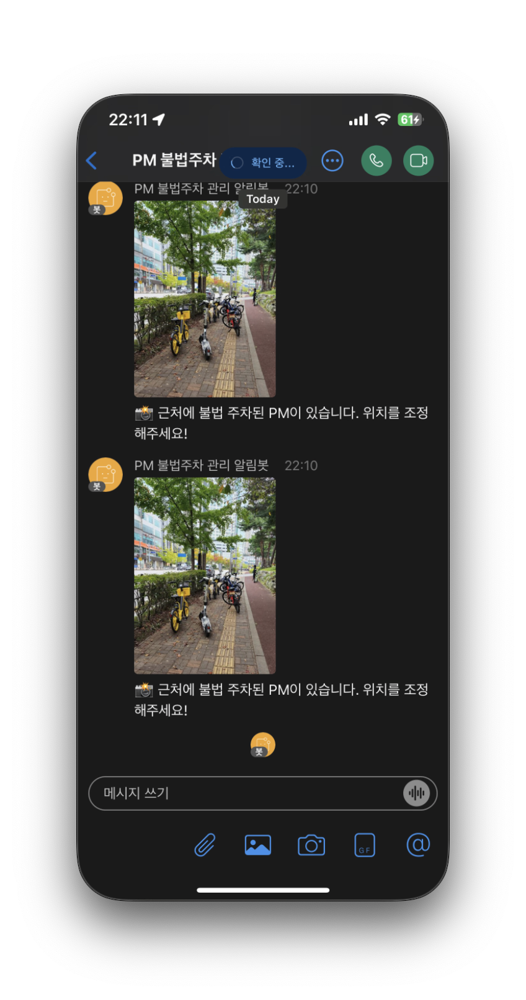
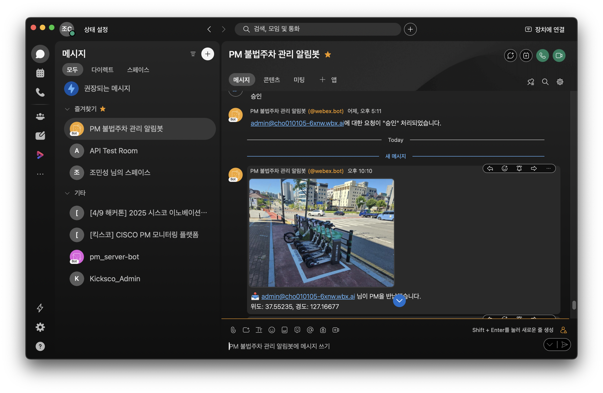
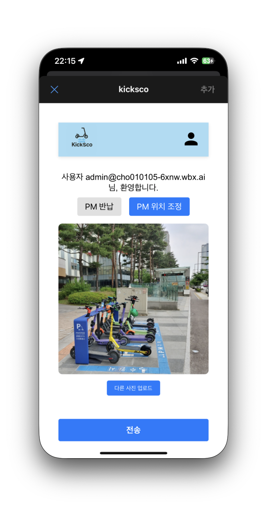
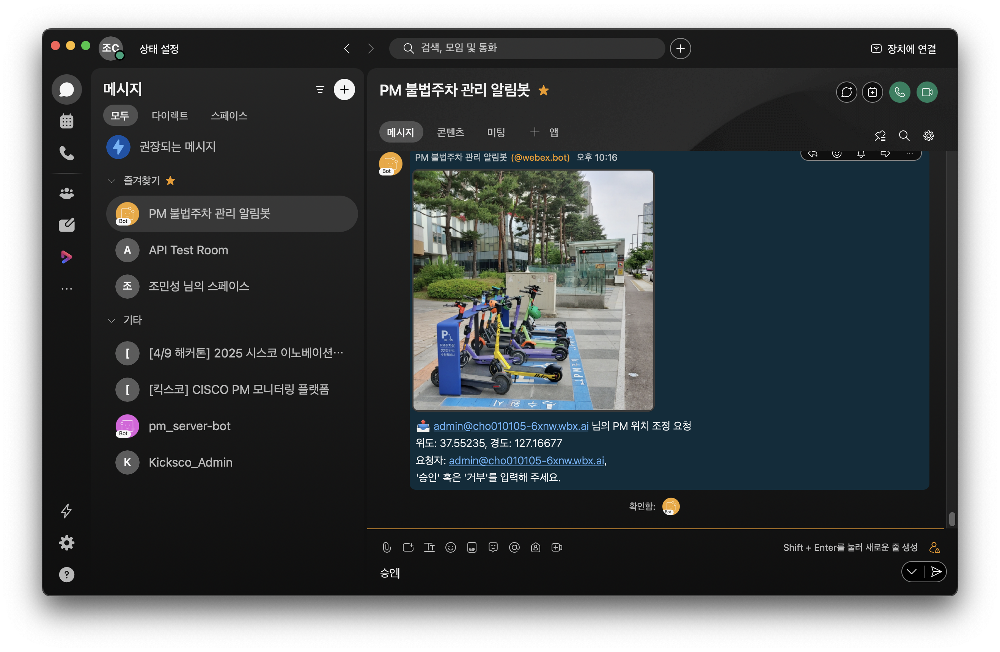
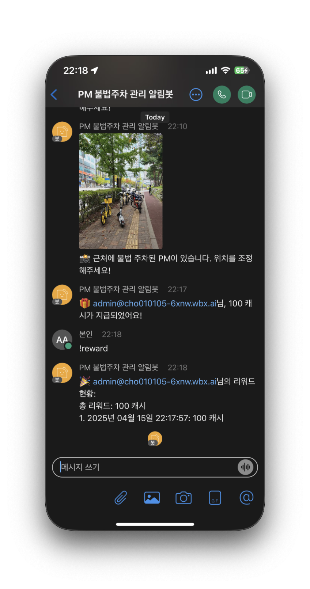
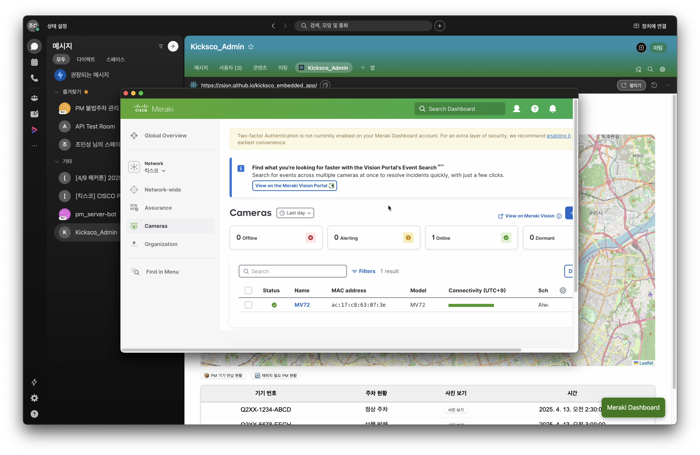

# 🚀 CISCO INNOVATION CHALLENGE 2025

## Webex Embedded App

Webex 메시징 API를 사용하여 PM(개인 모빌리티) 반납 확인 및 불법 주차 알림을 관리하는 데 도움을 주는 Webex Embedded App

---

## 개발 환경

- 프레임워크: React v18 이상
- 라우팅: React Router (HashRouter 사용 권장)
- 상태 관리: useState, useEffect 기반
- 디자인: CSS 커스텀 + react-toastify
- 배포: GitHub Pages

---

## 기술 스택 및 API

- [Webex Create a Message API](https://developer.webex.com/docs/api/v1/messages/create-a-message)
- [Webex Bot API](https://developer.webex.com/docs/bots)
- React
- react-toastify
- react-leaflet
- CSS
- React Router Dom v7

---

## 사전 준비 및 세팅 내용

```bash
npm install
npm install gh-pages react-router-dom react-toastify
```

- package.json에 homepage 설정

```json
"homepage": "https://zsjon.github.io/kicksco_embedded_app/"
```

- 라우팅 구조: 각각 사용자와 관리자로 구분

```jsx
<HashRouter basename="/kicksco_embedded_app">
  <Routes>
    <Route path="/" element={<User />} />
    <Route path="/admin" element={<AdminApp />} />
    <Route path="/detail" element={<UserDetail />} />
    <Route path="*" element={<Navigate to="/" replace />} />
  </Routes>
</HashRouter>
```

- 배포

```bash
npm run build
npm run deploy
```

---

## 🔌 Webex API Used 프로젝트 아키텍쳐

- [Create a Message API](https://developer.webex.com/docs/api/v1/messages/create-a-message)
- [Webex Bot API](https://developer.webex.com/docs/bots)

<p align="center">
  
</p>

#### 1. Webex Embedded App SDK 연동

- 클라이언트는 Webex의 `EmbeddedAppSdk`를 사용해 Webex 환경 안에서 사용자 정보, 공간(Space) 정보를 가져옵니다.
- 사용자 인증은 Webex 공간에 참여한 상태를 기반으로 자동 처리됩니다.

```javascript
const webex = new window.Webex.EmbeddedAppSdk();
await webex.ready();
const { spaceId } = await webex.getSpaceId();
const user = await webex.getUser();
```

#### 2. Webex Bot을 통한 메시지 자동 발송

- 서버에서는 Cisco Webex Bot의 Access Token(BOT_TOKEN)을 활용하여 Webex Messages API를 통해 메시지를 발송합니다.
- 메시지 수신자는 관리자의 이메일 주소이며, 사용자 위치 및 이미지가 첨부된 형태로 전송됩니다.

```javascript
await fetch("https://webexapis.com/v1/messages", {
  method: "POST",
  headers: {
    Authorization: `Bearer ${BOT_TOKEN}`,
    "Content-Type": "application/json",
  },
  body: JSON.stringify({
    toPersonEmail: ADMIN_EMAIL,
    text: "📸 불법 주차 감지: 위치 확인 요청!",
    files: ["https://yourserver.com/uploads/bodo_heatmap3.jpg"],
  }),
});
```

#### 3. Webex Messages API 사용 - Create a Message

- 사용자 반납 및 조정 요청 시 서버는 Bot 계정을 통해 Webex 공간 또는 특정 이메일에 메시지를 생성합니다.
- 이 API는 이미지 첨부와 함께 메시지를 전송할 수 있어, 현장의 주차 상태를 직관적으로 파악할 수 있도록 도와줍니다.

#### 4. 사용자 요청 흐름 요약

```
[사용자 화면]
  ⬇
  Webex Embedded App SDK로 사용자 및 공간 정보 획득
  ⬇
  사용자가 이미지 파일 첨부 + 위치 정보 자동 전송
  ⬇
[Node Server]
  ⬇
  Webex Messages API로 관리자에게 메시지 전송
  ⬇
[Webex 공간 내 관리자 확인 후 승인/거부 메시지]
  ⬇
  Webhook → Server에서 리워드 지급 여부 처리
```

#### 5. Webex Webhook + 명령어 처리

- 관리자는 승인 [이메일], 거부 [이메일], !reward 같은 명령어를 통해 사용자의 요청을 처리합니다.
- 서버는 webhook 엔드포인트(/webhook)를 통해 이를 처리하며, 승인 시 사용자의 리워드를 갱신합니다.

---

## 🧭 구현 과정

### 1. kicksco 앱 접속

<p align="center">
  
</p>

---

### 2. 사용자가 PM 반납 후 반납 사진 전송

<p align="center">
  
</p>

### 2-1. 주변 불법 주차 PM 재주차 요청 메시지 수신

<p align="center">
  
</p>

### 2-2. 관리자는 Webex Bot을 통해 사용자가 반납한 주차 사진 및 위치 수신

<p align="center">
  
</p>

---

### 3. 사용자가 불법 주차 PM 재주차 후 사진 전송

<p align="center">
  
</p>

### 3-1. 관리자 확인 후 승인

<p align="center">
  
</p>

---

### 4. 관리자 승인 시 리워드 지급 및 !reward 명령어를 통한 리워드 내역 확인

<p align="center">
  
</p>

---

### 5. 관리자 커스텀 대시보드 및 Meraki Dashboard로의 접근

- Custom Dashboard를 이용하여 PM 주차 현황 파악 및 사진 확인 가능
<p align="center">
  
</p>

- Meraki Dashboard에서 AI 카메라 관리 및 heatmap 관찰 가능
<p align="center">
  
</p>

---

## ✅ 주요 기능

- 사용자의 PM 반납 및 위치 조정 요청 UI 제공
- 갤러리 이미지 첨부 기능 (카메라 촬영 제외)
- 위치 정보 자동 획득 (Geolocation API, react-leaflet)
- 사용자 요청 전송 후 결과에 따라 토스트 알림 제공
- Webex Embedded SDK를 통한 사용자 정보 가져오기
- 관리자와 일반 사용자 경로 구분 (/#/admin vs /#/)
