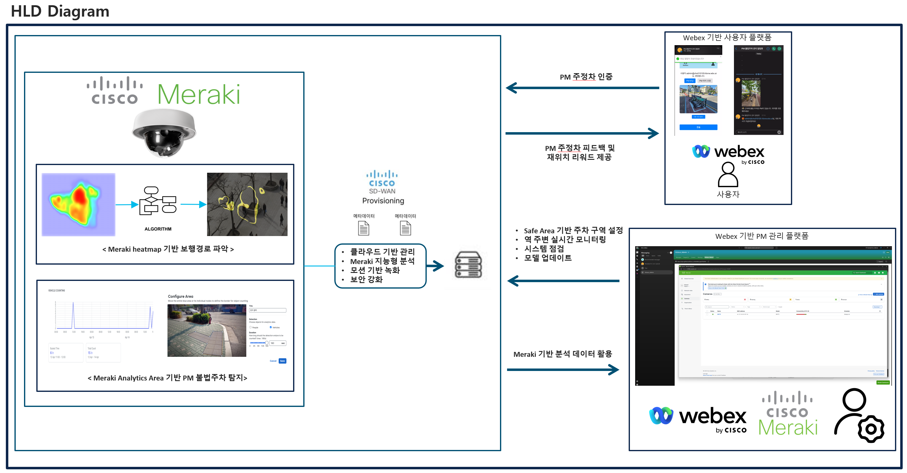
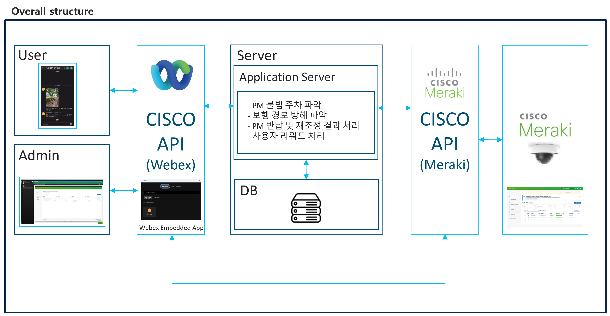
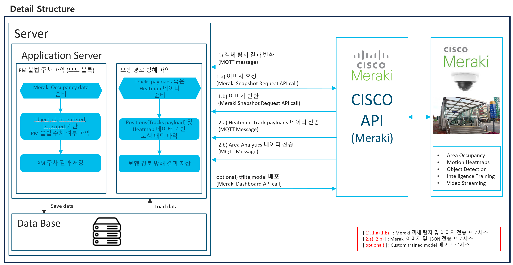
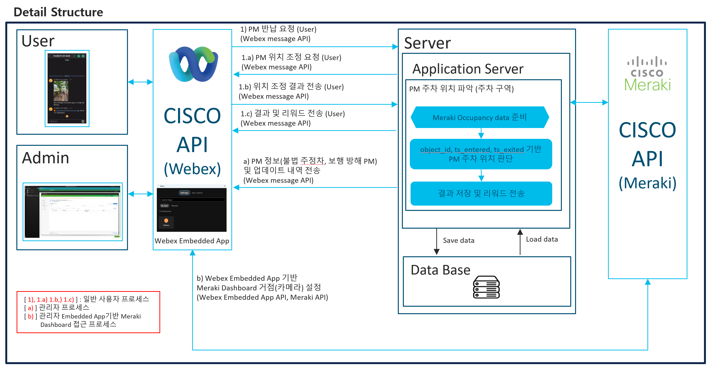

# 🚀 CISCO INNOVATION CHALLENGE 2025

## Project Info

- **Name**: CISCO PM 모니터링 플랫폼
- **Team**: 킥스코
- **Members**:
  - 김민서
  - 김민재
  - 박신혁
  - 박정수
  - 박주호
  - 조민서
  - 조민성

## Introduction

- Webex Embedded App, Meraki MV 기반 PM 모니터링 플랫폼
- 주요 거점 별 PM(Personal Mobility) 주차 상태와 보행자 보행경로를 파악하여, 부적절한 PM 주차 위치 대한 파악 및 관리, 즉각적 조치를 가능하게 하는 실시간 모니터링 시스템
- Meraki Analytics 기반 주차 구역 및 주차 금지 구역 PM 주차 여부 파악
- Meraki MV의 Motion heatmap 기반 보행자 보행 방해 요소 파악
- Webex Embedded App을 통해, 관리자 및 사용자 별도의 앱 없이 Webex 앱으로 실행 가능

- 장점

  - Meraki API, Webex API 활용 -> 전처리 및 개발 시간 단축
  - Meraki Dashboard를 통해 실시간 모니터링 및 데이터 파악 가능
  - Webex Embedded App을 통해 하나의 플랫폼에서 모든 작업 수행 가능
  - 필요시 Custom model 카메라에 업로드 가능

## Project Diagram

_Project Diagram_

## Architecture

_Overall Architecture_

_Meraki & Server Architecture_

_User Webex & Server Architecture_

## Subdirectories

- [Detection Module](CISCO_INNOVATION_CHALLENGE-detection/)
- [Embedded App Client](CISCO_INNOVATION_CHALLENGE-embedded_app_client/)
- [Embedded App Server](CISCO_INNOVATION_CHALLENGE-embedded_app_server/)
- [Web Server](CISCO_INNOVATION_CHALLENGE-web-server/)

Click on the links above to view detailed documentation for each module.
